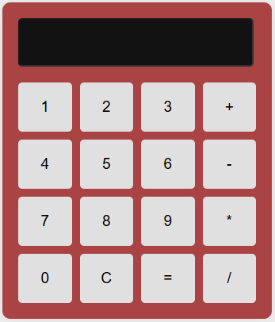

# Calculadora Simples

Este é um projeto de uma calculadora simples desenvolvida com HTML, CSS e JavaScript.

## Funcionalidades

- Adição, subtração, multiplicação e divisão de números.
- Interface de usuário responsiva e estilizada.
- Exibição de resultados e mensagens de erro.

## Estrutura do Projeto

O projeto é composto pelos seguintes arquivos:

- `index.html`: Estrutura HTML da calculadora.
- `style.css`: Estilos CSS para a interface da calculadora.
- `scritp.js`: Lógica JavaScript para as operações da calculadora.

## Como Usar

1. Clone este repositório para o seu ambiente local.
2. Abra o arquivo `index.html` em um navegador web.
3. Use os botões da calculadora para realizar operações matemáticas.

## Exemplo de Uso

1. Clique nos botões numéricos para inserir números.
2. Clique nos botões de operadores (`+`, `-`, `*`, `/`) para adicionar operadores.
3. Clique no botão `=` para calcular o resultado.
4. Clique no botão `C` para limpar a exibição.

## Captura de Tela

## Tecnologias Utilizadas

- HTML
- CSS
- JavaScript
